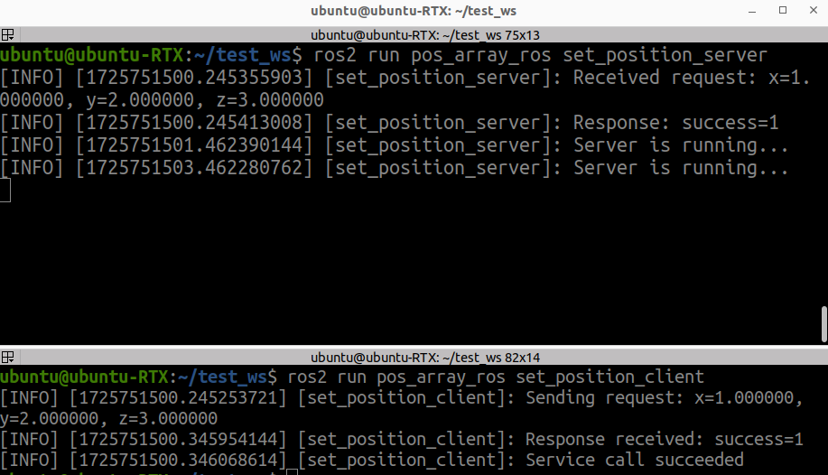

# ros2_custom_msg_sample

`ros2_custom_msg_sample` is a ROS 2 package that demonstrates the use of custom messages and services.

This package includes a custom message type `PosArray` and a custom service type `SetPosition`. It also provides a sample server and client for interacting with the service, as well as a publisher that sends messages on multiple topics.

## Supported ROS 2 distributions

[![humble][humble-badge]][humble]
[![ubuntu22][ubuntu22-badge]][ubuntu22]

## Requirements
- Ubuntu OS PC
  - Ubuntu 22.04 Humble

## Package Contents

- **Custom Messages:**
  - `PosArray`: A custom message type that includes an array of `geometry_msgs/Point` with an identifier.

- **Custom Services:**
  - `SetPosition`: A custom service type with request and response fields to set a position.

- **Sample Nodes:**
  - **`pos_array_publisher`:** A node that publishes messages of type `PosArray` on four different topics.
  - **`set_position_server`:** A node that provides a service of type `SetPosition`.
  - **`set_position_client`:** A node that calls the `SetPosition` service and processes the response.

## Usage

### Start the custom msg publisher:

```sh: terminal
ros2 run pos_array_ros pos_array_publisher
```

### Start the service & client:

Start the service server:

```sh: terminal
ros2 run pos_array_ros set_position_server
```

Run the client (in a new terminal):

```sh: terminal
ros2 run pos_array_ros set_position_client
```



## License
This repository is licensed under the Apache Software License 2.0, see LICENSE.

[humble-badge]: https://img.shields.io/badge/-HUMBLE-orange?style=flat-square&logo=ros
[humble]: https://docs.ros.org/en/humble/index.html

[ubuntu22-badge]: https://img.shields.io/badge/-UBUNTU%2022%2E04-blue?style=flat-square&logo=ubuntu&logoColor=white
[ubuntu22]: https://releases.ubuntu.com/jammy/
